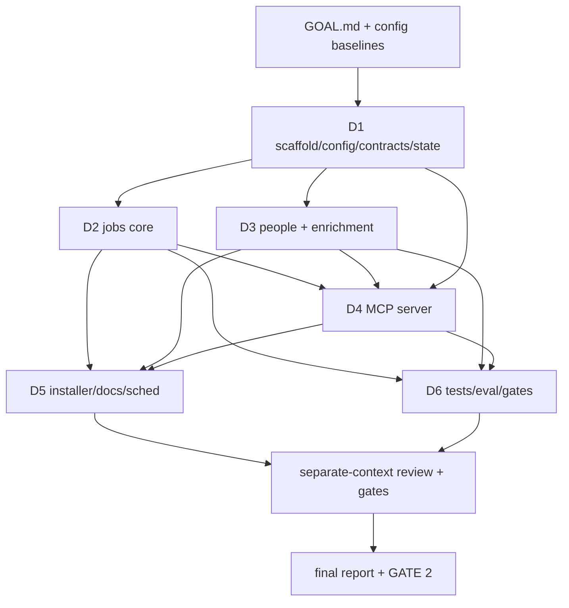

# GOAL DOCUMENT — LinkedIn Coffee Pipeline (`linkedin-coffee-pipeline`)

> **Status surface for an autonomous `/loop` + heartbeat run.** Updated every wake.
> **Authored:** 2026-06-27 · **Branch base:** `main` (this is a fresh repo).
> **Definition of done** is the checklist in §9. The loop does not terminate
> until every box there is ticked.

## 0. Role & framing

You are the lead engineer building a **standalone, easily-shared local tool** that
turns LinkedIn/job-board noise into a **ranked, warm list of people worth grabbing
coffee with**, attached to roles the user would genuinely want. The through-line:
**Jobs → companies → people → contact path → a genuine, non-salesy coffee ask.**
Networking is king; the job board is just the lens.

Source plan: `linkedin-job-pipeline-reference.md` (in the agent_fleet repo). This
repo is the *implementation* of that plan as a separate, installable product.

- **Blast radius:** **large** (multi-deliverable greenfield product: scraping core,
  ranking, people layer, enrichment waterfall, MCP server, installer, Claude Desktop
  integration, scheduling, docs).
- **Routing (blast-radius × is-it-behavior):** Mostly **deterministic data tooling**
  (NOT agent-behavior) — scraping, dedup, ranking, scoring are pure Python with
  code-graded scorers → `standard` eval/observability. The **one** agent-behavior
  surface is the MCP server's tool-selection + outreach-drafting contract used by
  Claude Desktop → that surface is bumped to `standard`+ (tool registration is
  code-graded; outreach quality has an LLM-judge rubric). Tier = **large, non-behavior
  core + standard MCP surface**; full ceremony on the core, code-graded gates everywhere.

**Design split (load-bearing):**
- **Deterministic Python** does the heavy lifting (scrape, proxy test, dedup, rank,
  score) — predictable, debuggable, cron-able, runs without Claude.
- **Claude Desktop** does judgment + relationship layer (who to meet, why, draft the
  ask) on top of the Python outputs, via an MCP server. Confirmation-gated on any
  account-risk action (StaffSpy enumeration, credit-spend, outreach send).

**Operator's meta-asks (must be honored):**
1. Open questions in the source plan §9/§10 → **build multiple options + a `config.yaml`
   with useful baselines**, not a single hardcoded choice.
2. **Separate repo**, easily shared, **easy installer** for a non-github person.
3. **Easily integratable into Claude Desktop** (one-command MCP wiring).
4. Shell implementation to Pi where possible (fell back to Sonnet subagents — Pi's
   secret broker/.env is currently down; see ledger routing note).

## 1. The coupled deliverables

| # | Deliverable | Phase owner | Gates / coupling |
|---|---|---|---|
| **D1** | **Scaffold, config, contracts, state** — pyproject/uv, package skeleton, `config.*.yaml` (multi-option + baselines), `profile`/`rubric` configs, pydantic data contracts, SQLite state schema, secrets handling, `lcp` CLI entrypoint | Plan→Work→Review | **Foundation. Blocks D2–D6.** Everything imports `lcp.config`, `lcp.contracts`, `lcp.state`. |
| **D2** | **Jobs core** — `proxy_check.py` (multi-gateway options), `fetch_jobs.py` (JobSpy + dedup), `rank_jobs.py` (rubric pre-filter + score) | Plan→Work→Review | Consumes D1 contracts/state. Independent of D3. |
| **D3** | **People & enrichment core** — `fetch_staff.py` (StaffSpy, own IP), `score_people.py` (warmth+relevance), `enrich.py` (free-tier waterfall, pluggable providers) | Plan→Work→Review | Consumes D1 contracts/state + D2 shortlist. Independent of D2 internals. |
| **D4** | **Pipeline MCP server** — FastMCP server exposing read tools + confirmation-gated action tools, outreach drafting, Claude Desktop config generator | Plan→Work→Review | Consumes D1–D3. The Claude-facing surface. |
| **D5** | **Installer + onboarding + scheduling + compliance docs** — `install.sh` (idempotent, non-technical), launchd/cron scheduler, friendly README, `COMPLIANCE.md` (GDPR/NL), `CLAUDE_DESKTOP.md`, example Claude Desktop config | Plan→Work→Review | Wires D1–D4 into a usable product. Consumes research output. |
| **D6** | **Tests + eval scorers + gates + `lcp doctor`** | per-deliverable + integration | Cross-cuts D1–D5; the executable proof of §7. |

Deliverables are **coupled**: D1 is the shared contract (must land first); D2/D3 are
parallel-safe on disjoint paths; D4 depends on D1–D3; D5 depends on all; D6 cross-cuts.

### 1a. Tagged plan steps → agent chains + domain triggers

| Step | Tag | Agent chain | Domain trigger fired |
|---|---|---|---|
| D1 scaffold/config/contracts/state | impl+schema | sonnet-impl → separate-context reviewer | schema-change → contract+state validator |
| D2 jobs core | impl | sonnet-impl → reviewer | — |
| D3 people/enrichment | impl | sonnet-impl → reviewer | secrets/PII → compliance check |
| D4 MCP server | impl+agent-surface | sonnet-impl → reviewer (agent-native + security lens) | new agent tool → confirmation-gate check |
| D5 installer/docs/sched | impl+docs | sonnet-impl → reviewer | installer → idempotency/dry-run check |
| D6 tests/gates | test | sonnet-impl → reviewer | — |

## 2. The DAG

**Critical path:** D1 → (D2 ∥ D3) → D4 → D5 → review → report.
**Parallelism policy:** D1 solo first (shared contract). Then D2, D3 fan out in
parallel on disjoint paths. D4 after D2+D3. D5 after D4. D6 woven through. Fan out
cheap read/research agents freely; one sole-owner per build workstream.

## 3. Per-deliverable detail (requirement + TDD + acceptance criteria)

### D1 — Scaffold, config, contracts, state
**Requirement:** a `pip/uv`-installable `lcp` package with a typed config layer that
encodes the source-plan open questions as **selectable options with baselines**, a
pydantic contract for every data artifact, and a SQLite state store for dedup/seen/
contacted. TDD: write `tests/test_contracts.py`, `tests/test_config.py`,
`tests/test_state.py` first.

> **AC-001 (config = options + baselines)**
> - **scenario:** operator opens `config/config.example.yaml`
> - **action:** loads it via `lcp.config.load_config()`
> - **expected:** every source-plan open question (proxy provider, enrichment
>   waterfall order, account mode, scheduling mode, MCP vs filesystem, draft-vs-send)
>   appears as a documented key with ≥2 commented options and one active baseline.
> - **must-not:** any open question silently hardcoded in code with no config knob.
> - **verification:** `python -m pytest tests/test_config.py -k options_and_baselines` exit 0; `python scripts/check_config_covers_open_questions.py` exit 0.
> - **priority:** P0

> **AC-002 (typed contracts)**
> - **scenario:** a jobs/shortlist/staff/people_to_meet artifact is produced
> - **action:** validate it against `lcp.contracts`
> - **expected:** pydantic models exist for JobPost, Shortlist entry, Staff, PersonToMeet matching the §5 suggested contracts; round-trips parquet/json.
> - **must-not:** untyped dict passing between stages.
> - **verification:** `pytest tests/test_contracts.py` exit 0.
> - **priority:** P0

> **AC-003 (state dedup)**
> - **scenario:** the same job/person is seen across two runs
> - **action:** `lcp.state` records first_seen and is queried before re-emitting
> - **expected:** `seen_jobs`, `companies_enumerated`, `people_contacted` tables; a job seen twice is not re-emitted as new; a contacted person is never re-drafted.
> - **must-not:** double-outreach or re-scrape of seen items.
> - **verification:** `pytest tests/test_state.py -k dedup` exit 0.
> - **priority:** P0

### D2 — Jobs core
**Requirement:** deterministic, cron-able jobs pipeline with config-selectable proxy
gateway. TDD: `tests/test_rank_jobs.py` (pure, no network) first; network calls behind
an injectable client so tests mock.

> **AC-010 (proxy options + check)**
> - **scenario:** operator selects a proxy backend in config (`none|free_pool|webshare|in_process|scrapoxy`)
> - **action:** `lcp proxies check` probes candidates against a real LinkedIn job request and writes `good_proxies.json`
> - **expected:** ≥2 backends implemented behind one interface; `none` works for MVP (own IP); the chosen backend yields a validated list or a clear empty-with-reason.
> - **must-not:** StaffSpy ever routed through a proxy (JobSpy-only by design §6).
> - **verification:** `pytest tests/test_proxy.py` exit 0 (mocked); `lcp proxies check --dry-run` exit 0.
> - **priority:** P1

> **AC-011 (fetch jobs + dedup)**
> - **scenario:** run `lcp jobs fetch` with search terms + locations from config
> - **action:** JobSpy is called with `proxies=` from good list; results deduped vs state; written to `jobs.parquet`(+csv)
> - **expected:** artifact matches the JobPost contract; re-running does not duplicate prior jobs (first_seen preserved).
> - **must-not:** crash when a board returns 0 / is unavailable in NL — degrade gracefully per-board.
> - **verification:** `pytest tests/test_fetch_jobs.py` exit 0 (mocked JobSpy); `lcp jobs fetch --dry-run` exit 0.
> - **priority:** P0

> **AC-012 (rank jobs)**
> - **scenario:** `jobs.parquet` + rubric → `shortlist.json`
> - **action:** `lcp jobs rank` applies the deterministic pre-filter + weighted score from `rubric.yaml`
> - **expected:** hundreds → a handful; each shortlist entry has `{job_id, score, reasons[]}`; ordering is deterministic for a fixed input.
> - **must-not:** non-deterministic ranking; dropping all jobs silently.
> - **verification:** `pytest tests/test_rank_jobs.py` exit 0 (golden input → expected order).
> - **priority:** P0

### D3 — People & enrichment core
**Requirement:** people layer on selected companies + warmth scoring + enrichment
waterfall. TDD: `tests/test_score_people.py`, `tests/test_enrich.py` (mocked providers).

> **AC-020 (staff fetch, own IP)**
> - **scenario:** operator approves N companies → `lcp staff fetch --company ...`
> - **action:** StaffSpy runs on own IP with a persistent session file; results → `staff.parquet`
> - **expected:** education/experiences/skills/contactable fields per the contract; respects a config daily ceiling; **never uses a proxy**.
> - **must-not:** exceed the human-pace ceiling; run without explicit company selection.
> - **verification:** `pytest tests/test_fetch_staff.py` exit 0 (mocked StaffSpy); ceiling enforced in a unit test.
> - **priority:** P1

> **AC-021 (warmth scoring — the networking core)**
> - **scenario:** `staff.parquet` + operator `profile.yaml` → `people_to_meet.json`
> - **action:** `lcp people score` ranks by warmth (shared school/employer, mutual-conn proxy, role fit, recency) using configurable weights
> - **expected:** deterministic ranked list with `{name, company, why[], warmth_score, contact_status}`; `why[]` cites the matched signals.
> - **must-not:** opaque score with no `why[]`; weights hardcoded (must come from config).
> - **verification:** `pytest tests/test_score_people.py` exit 0 (golden profile+staff → expected ranking + reasons).
> - **priority:** P0

> **AC-022 (enrichment waterfall)**
> - **scenario:** a selected person needs a contact path
> - **action:** `lcp enrich person` cascades across configured free-tier providers in order until a verified hit or exhaustion
> - **expected:** ≥2 provider adapters behind one interface + a `null` provider; waterfall order from config; stops on first verified email/phone; logs which provider hit.
> - **must-not:** spend a paid credit without config opt-in; leak keys to logs.
> - **verification:** `pytest tests/test_enrich.py` exit 0 (mocked providers, cascade + stop-on-hit asserted).
> - **priority:** P1

### D4 — Pipeline MCP server
**Requirement:** a FastMCP server Claude Desktop loads, exposing the pipeline as
first-class tools with confirmation gates on risky actions. TDD: `tests/test_mcp.py`
asserts tool registration + that gated tools require a confirm flag.

> **AC-030 (MCP tools registered)**
> - **scenario:** Claude Desktop connects to the server
> - **action:** server advertises tools: `get_shortlist`, `list_people_to_meet`,
>   `run_jobspy`, `run_staffspy(company)`, `score_people`, `enrich_person`,
>   `draft_outreach`, `mark_contacted`
> - **expected:** all tools registered with schemas + docstrings; read tools un-gated; `run_staffspy`/`enrich_person`/any send **gated behind explicit confirmation**.
> - **must-not:** an account-risk or credit-spend tool that fires without confirmation.
> - **verification:** `pytest tests/test_mcp.py` exit 0 (registration + gating asserted); `lcp mcp --selfcheck` exit 0.
> - **priority:** P0

> **AC-031 (outreach drafting, draft-only baseline)**
> - **scenario:** Claude calls `draft_outreach(person)`
> - **action:** returns a personalized, non-salesy coffee-chat draft grounded in `why[]` + research-backed framing; **does not send** (baseline = draft-only; send is a config opt-in + separate gated tool)
> - **expected:** draft references the specific warmth signal; tone matches the template; output is a draft object, never a send side-effect.
> - **must-not:** auto-send; generic spam template.
> - **verification:** `pytest tests/test_mcp.py -k draft` exit 0 (draft references injected signal, no send path reachable in draft-only mode); LLM-judge rubric (eval §7) on 10 golden persons.
> - **priority:** P0

### D5 — Installer + onboarding + scheduling + compliance
**Requirement:** a non-github person can install and wire Claude Desktop in one command.

> **AC-040 (one-command installer)**
> - **scenario:** a non-technical operator runs `./install.sh`
> - **action:** installer checks/installs uv, creates `.venv`, installs deps, copies example configs to live configs (idempotent, never clobbers existing), prints clear next steps
> - **expected:** idempotent (second run is a no-op-ish), `--dry-run` prints commands, exits 0 on a clean Mac; clear errors otherwise.
> - **must-not:** clobber an existing user config; require git knowledge; fail silently.
> - **verification:** `bash scripts/test_install_dryrun.sh` exit 0; `./install.sh --dry-run` exit 0; re-run idempotency asserted.
> - **priority:** P0

> **AC-041 (Claude Desktop wiring)**
> - **scenario:** operator runs `./install.sh claude-desktop` (or installer offers it)
> - **action:** merges the `linkedin-coffee-pipeline` MCP entry into `claude_desktop_config.json` (backs up first), or prints the exact JSON to paste
> - **expected:** valid JSON after merge; existing MCP servers preserved; a `claude_desktop_config.example.json` is shipped.
> - **must-not:** corrupt an existing Claude Desktop config; overwrite other servers.
> - **verification:** `pytest tests/test_claude_desktop_config.py` exit 0 (merge preserves existing keys, output is valid JSON).
> - **priority:** P0

> **AC-042 (compliance doc, GDPR/NL)**
> - **scenario:** operator wants to know what's safe in NL/EU
> - **action:** read `docs/COMPLIANCE.md`
> - **expected:** lawful-basis summary, ePrivacy/cold-contact do/don't for 1:1 networking, EU-friendlier source guidance, human-checkpoint requirement — grounded in the research output, labeled engineering-note-not-legal-advice.
> - **must-not:** absent or hand-wavy; must reflect the research findings.
> - **verification:** `scripts/gates/...`-style presence+non-trivial check; reviewer confirms it reflects research.
> - **priority:** P1

> **AC-043 (local scheduling)**
> - **scenario:** operator wants the deterministic core to run daily without Claude
> - **action:** `scripts/schedule_macos.sh install` writes a launchd plist running `proxy check → jobs fetch → jobs rank`
> - **expected:** plist installs/loads/unloads cleanly; a `cron`/other-OS note is documented; failures are logged.
> - **must-not:** assume Claude/desktop must be open for the scrape (decoupled per §7).
> - **verification:** `bash scripts/schedule_macos.sh --dry-run` exit 0; plist validates (`plutil -lint`).
> - **priority:** P2

## 7. Evaluation Plan (how we'll KNOW it works)

**How we'll KNOW it works:** the end-to-end product runs on a clean machine — installer
succeeds, the deterministic core produces a valid `shortlist.json` and (on a selected
company) a `people_to_meet.json` with cited warmth reasons, the MCP server loads in
Claude Desktop and exposes gated tools, and Claude can produce a personalized coffee-chat
draft for a golden person. **Pass bar:** every P0 AC's verification exits 0; the
installer dry-run is green; the MCP self-check passes; the outreach LLM-judge rubric
passes ≥ 8/10 golden persons. **Falsified if:** any P0 verification is red, a gated tool
fires without confirmation, ranking/scoring is non-deterministic, or the installer
clobbers an existing config.

**Per-capability binary scorers** (code-graders first; one per capability):
| capability | scorer (binary pass/fail, code unless noted) | pass bar |
|---|---|---|
| config-covers-open-questions | `check_config_covers_open_questions.py` — every §9 OQ has a config key + ≥2 options | exit 0 |
| contracts-valid | `pytest test_contracts` — artifacts parse against pydantic | 100% |
| state-dedup | `pytest test_state -k dedup` | 100% |
| rank-deterministic | `pytest test_rank_jobs` — golden input → fixed order | 100% |
| warmth-cites-reasons | `pytest test_score_people` — every entry has non-empty `why[]` | 100% |
| enrich-waterfall | `pytest test_enrich` — cascade + stop-on-hit + no-uncfg-paid-spend | 100% |
| mcp-gating | `pytest test_mcp` — risky tools require confirm flag | 100% |
| installer-idempotent | `scripts/test_install_dryrun.sh` — dry-run green + re-run no clobber | exit 0 |
| claude-desktop-merge | `pytest test_claude_desktop_config` — merge preserves existing, valid JSON | 100% |
| outreach-quality (LLM judge) | rubric: references specific warmth signal, non-salesy, asks for coffee, ≤150 words | ≥ 8/10 |

- **Golden / seed set:** `eval/golden/` — 10 synthetic (job, company, staff, profile)
  fixtures incl. real failure shapes (board returns 0; no email found; person already
  contacted; weak/no warmth signal). Hand-authored, no real PII.
- **LLM judge (outreach only):** rubric-scored; version the prompt; this is the only
  non-code scorer, used solely on draft quality. Document the rubric in `eval/`.
- **Observability hooks:** every stage writes a structured run-log line (stage, counts
  in/out, source, duration, proxy/provider used, dedup hits) to `data/runs/<ts>.jsonl`;
  `lcp doctor` summarizes last run. The MCP server logs each tool call (name, gated?,
  confirmed?). Tests inspect these logs, not just the output files.
- **Report artifacts:** a funnel metric (jobs fetched → shortlisted → companies → people
  → people-to-meet → drafts) + the eval scorer table, surfaced in the final report's
  `## Did it actually work? (evidence)` section.

## 8. Operating rules for the loop

- Worktrees for every parallel build inside this repo (`git worktree add`); D2/D3 on
  disjoint branches. Commit with explicit paths only.
- `uv` + `pyproject.toml`, repo-local `.venv`. Python ≥ 3.11.
- Secrets via `.env` (gitignored) + OS keychain helper; only `*.example` committed.
  Never log keys.
- `#TODO:` every deferred decision AND a line in §10.
- One sole-owner per workstream; don't spawn duplicates for dormant agents.
- Loop bound MANDATORY: `--max-runs` + `max_consecutive_failures=3` + a wall-clock
  ceiling + plateau (3 non-improving iters → escalate).
- Each wake appends a progress-log block to the ledger.
- Implementations CONSUME/CAPTURE behavior evidence (run-logs); tests inspect it; the
  separate-context review checks observability + that evidence corroborates the claim.
- **Confirmation-gate is sacred:** StaffSpy enumeration, credit-spend, and outreach
  send are ALWAYS human/Claude-confirmation gated. Draft-only is the baseline.
- Escalate (AskUserQuestion) at genuine forks (e.g. account ban-risk policy, paid spend).
- Gates are append-only — never weaken a gate or delete a test to get green.

## 9. DEFINITION OF DONE (loop terminates only when ALL are ✅)

- [ ] **D1** AC-001 config options+baselines · AC-002 contracts · AC-003 state dedup
- [ ] **D2** AC-010 proxy options · AC-011 fetch+dedup · AC-012 rank deterministic
- [ ] **D3** AC-020 staff own-IP+ceiling · AC-021 warmth scoring+reasons · AC-022 enrich waterfall
- [ ] **D4** AC-030 MCP tools+gating · AC-031 outreach draft-only
- [ ] **D5** AC-040 installer · AC-041 Claude Desktop wiring · AC-042 compliance doc · AC-043 scheduling
- [ ] **D6** all scorer commands in §7 green; `lcp doctor` runs; funnel metric emitted
- [ ] Separate-context review on each deliverable, no unresolved blocking verdict
- [ ] Final report with asked-vs-done diff + `## Did it actually work? (evidence)`
- [ ] Repo is self-contained, `./install.sh` green on clean Mac, Claude Desktop wiring works

## 10. Open questions / running decision list (resolved as config options + baselines)

All source-plan §9/§10 open questions are resolved as **config options with a baseline**
(operator's explicit instruction) and/or a research lookup. Each gets a config key:

- Job rubric (roles/seniority/location/recency/salary) → `rubric.example.yaml` baseline
  for an Amsterdam-based seeker; operator fills in specifics. `#TODO` operator personalizes.
- Warmth weights + own profile → `profile.example.yaml` + `rubric.yaml` weights;
  baseline weights provided. `#TODO` operator fills profile.
- Draft vs send → `config.outreach.mode: draft_only` baseline (send is opt-in + gated).
- Proxy budget/type/gateway → `config.proxies.backend: none` baseline (MVP own IP);
  options: free_pool/webshare/in_process/scrapoxy. Pricing from research.
- Account mode + captcha → `config.staffspy.account_mode` + `session_file` baseline;
  daily ceiling baseline from research item 8.
- linkedin-mcp-server vs StaffSpy → documented as an alternative people-layer in
  `CLAUDE_DESKTOP.md`; `#TODO` resolved by research item 6.
- Enrichment waterfall order + free vs paid → `config.enrichment.waterfall` baseline
  from research item 1/2 (free-tier-first cascade).
- MCP vs filesystem-only → ship the custom pipeline MCP (recommended) AND document
  filesystem-MCP fallback.
- SQLite schema / freshness window / people dedup → fixed in D1 `state.py`; freshness
  window a config key.
- Secrets store → `.env` + keychain helper.
- GDPR/NL → `docs/COMPLIANCE.md` from research item 3.

## 11. Sources & links
- Source plan: `agent_fleet/linkedin-job-pipeline-reference.md`
- JobSpy `speedyapply/JobSpy` · StaffSpy `cullenwatson/StaffSpy` ·
  `stickerdaniel/linkedin-mcp-server` · Apollo/Hunter/LeadMagic/Prospeo MCPs ·
  Scrapoxy/proxy_pool/mitmproxy · MCP Python SDK (FastMCP).
- Research subagent output (volatile facts, §10 of source plan) → folded into config
  baselines + `docs/COMPLIANCE.md`.
