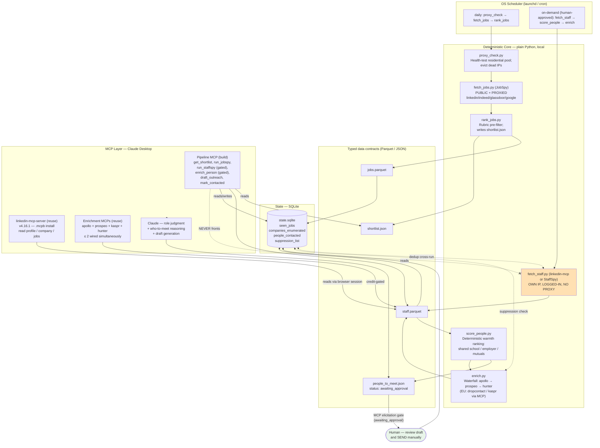

# Build-Grounding Dossier — linkedin-coffee-pipeline
**Synthesized 2026-06-27 | Sources: Report A (OSS repos + reference architecture), Report B (Claude/MCP ecosystem), Report D (GDPR / Dutch law), Volatile-Facts Grounding (§1–§9)**

> **Note on scope.** Four research prompts were planned (A, B, C, D). **Report C (engineering best-practices: scraping resilience, proxy health, SQLite dedup, MCP security hardening)** was not captured in a standalone deep-research report. Its ground is covered by the volatile-facts grounding report (`docs/research/2026-06-27_volatile_facts_grounding.md`, §4–§8), which is cited throughout this dossier where Report C content would otherwise appear. All figures are last-verified 2026-06-27 and are time-sensitive; re-check before go-live.

---

## 1. Reference Architecture

The pipeline is a strict two-plane system. **Plane 1 (proxied / public)** uses JobSpy over rotating residential proxies and never touches an authenticated LinkedIn session. **Plane 2 (own-IP / authenticated)** uses the linkedin-mcp-server and optionally StaffSpy, always on the user's residential IP with no proxy. These planes must never be bridged — proxying an authenticated session is a first-order LinkedIn ban signal [Report A §1.5].

**Boundary note.** The deterministic core writes typed files; the MCP layer reads them. Claude never scrapes and never sends autonomously. The elicitation gate (`status: awaiting_approval` in `people_to_meet.json` + MCP confirmation prompt) is the only path to a draft reaching the human [Report A §3.1; Report B §3].

---

## 2. Resolved Configuration Rationale

Every baseline in `linkedin-coffee-pipeline/config/config.example.yaml` is traced to one or more research findings. The table below covers each major section; the `config.*` keys are the canonical identifiers.

### 2.1 Proxy Backend (`config.proxies`)

| Baseline | Value | Research backing |
|---|---|---|
| `proxies.backend` | `none` (Phase 1 MVP) → `webshare` residential for Phase 2 | Report A §1.6: free-proxy pools are stale; datacenter IPs "blocked by LinkedIn on arrival" (Volatile-facts §7). Webshare residential ~$1.40/GB, 1–3 GB/mo = ~$2–4 for personal search (Volatile-facts §7). |
| `proxies.webshare.type` | `residential` | Volatile-facts §7: "Webshare itself says DC 'doesn't work on LinkedIn'." Residential survives the LinkedIn board. |
| `proxy_staffspy` / `proxy_linkedin_mcp` | `none` (own home IP) | Report A §1.2 + §1.5: proxying a logged-in session is a ban signal. Hard rule: no proxy on authenticated planes. |
| `proxies.check_target` | `linkedin` | Volatile-facts §7: LinkedIn is the hardest board; proxy validity for other boards implied by passing LinkedIn. |

**Contradiction resolved.** Report A describes mitmproxy as an optional rotating gateway; Volatile-facts §7 confirms that for a single user, passing the proxy list directly to JobSpy's `proxies=` parameter is sufficient — no separate gateway process needed at personal volume.

### 2.2 People Layer (`config.people`)

| Baseline | Value | Research backing |
|---|---|---|
| `people.provider` | `linkedin_mcp` (default) | Volatile-facts §6: linkedin-mcp-server v4.16.1 (active, daily releases as of 2026-06-26), 2,500 stars, richer per-call than StaffSpy, exposes `send_message`/`get_inbox`. Adequate for ≤50 lookups/day. |
| `people.volume_threshold_use_staffspy` | 50 | Volatile-facts §6: linkedin-mcp "NOT for batch 500+ (synchronous per-call)." StaffSpy for bulk enumeration; linkedin-mcp for interactive. |
| `people.staffspy.session_file` | `session.pkl` | Volatile-facts §4: session lasts ~1 week; avoids re-login captchas. |
| `people.staffspy.captcha_solver` | `2captcha` | Volatile-facts §4: "CapSolver unreliable for FuncCAPTCHA → prefer 2Captcha / browser login." |
| `people.staffspy.max_profiles_per_company_per_day` | 75 | Volatile-facts §4 + §8: community consensus 50–100/day; 75 is the conservative midpoint. |
| `people.staffspy.inter_request_delay_sec` | 8 | Volatile-facts §4 + §8: 5–10s delays; 8s chosen. |
| `people.linkedin_mcp.max_profiles_per_day` | 50 | Volatile-facts §6: 50/day interactive ceiling for linkedin-mcp. |
| `people.linkedin_mcp.per_lookup_delay_sec` | 45 | Volatile-facts §8: 30–60s between sequential lookups. |

### 2.3 Enrichment Waterfall (`config.enrichment`)

| Baseline | Value | Research backing |
|---|---|---|
| `enrichment.mode` | `mcp` | Report B §3: enrichment MCPs exist (Apollo, Prospeo, Kaspr, Hunter); MCP mode avoids building a separate waterfall for solo use. Batch mode (`python`) for bulk. |
| `enrichment.waterfall` | `[apollo, prospeo, hunter]` | Volatile-facts §1–§2: Apollo (native MCP, free, confirmation-gated, phone + email), Prospeo (75/mo, native MCP `mcp.prospeo.io`, LI-URL→email), Hunter (50/mo, email-only). LeadMagic/Findymail/ContactOut/RocketReach have no working Claude Desktop MCP (Volatile-facts §2). |
| `enrichment.eu_preferred` | `[dropcontact, kaspr]` | Report D §1.5: Dropcontact (CNIL-audited, no stored database, strongest GDPR posture) + Kaspr (French, Art 6(1)(f) documented; fined €240k Dec 2024 but remediated Mar 2026 per CNIL SAN-2026-004). Volatile-facts §3: EU-friendlier sources. |
| `enrichment.allow_paid_spend` | `false` | Report B §1 + Volatile-facts §1: every enrichment MCP requires paid API key at provider level. Default: free-tier only; opt-in required for paid credits. |
| `apollo.confirmation_gate` | `"Approval required"` | Report B §1: Apollo docs recommend "Approval required" for credit-consuming tools; the only native MCP with built-in confirmation design [Report B §1; Volatile-facts §2]. |

**Proxycurl is dead** (shut down 4 July 2025 after LinkedIn's lawsuit; founder Steven Goh confirmed no winning the litigation). **Scrapoxy is discontinued** (repo is a 3-commit tombstone). Neither is referenced in the config [Report A §1.3, §1.6].

### 2.4 Outreach Defaults (`config.outreach`)

| Baseline | Value | Research backing |
|---|---|---|
| `outreach.mode` | `draft_only` | Report D §4.1: "the tool never auto-sends" is a hard red line. MCP elicitation gates the draft. |
| `outreach.channel_preference` | `linkedin_dm_first` | Report D §2.2: LinkedIn DM carries materially lower statutory exposure under Tw art 11.7 than cold email. Volatile-facts §3: encodes as `outreach_channel_preference: linkedin_dm_first`. |
| `outreach.cold_email_target_filter` | `corporate_domain_only` | Report D §3.1: BV/NV professional address = B2B path (permitted); personal webmail and ZZP = opt-in required. |
| `outreach.message_max_words` | 100 | Volatile-facts §9: "< 100 words (< 300 chars for connect note)"; specificity in sentence 1 = 3× reply rate vs template. |
| `outreach.send_window` | `Tue-Wed 09:00-12:00 CET` | Volatile-facts §9: optimal send window for NL market. |
| `outreach.sequence.step_0` | `engage_content_first` | Volatile-facts §9: micro-engagement (like/comment + 24h wait) roughly doubles accept rate (8% → 14%). |

### 2.5 Account Safety (`config.account_safety`)

| Baseline | Value | Research backing |
|---|---|---|
| `automation_hours` | `08:00-21:00` | Volatile-facts §8: human hours Amsterdam local. |
| `pause_on_captcha_hours` | 48 | Volatile-facts §8: "stop 48–72h on challenge." |
| `linkedin_connection_requests_per_week` | 50 | Volatile-facts §8: Unipile's published cadence (~80–100/week on paid accounts); 50 is the conservative solo ceiling [Report A §1.6; Volatile-facts §8]. |
| `linkedin_messages_per_day` | 15 | Volatile-facts §8: 15–20 msgs/day ceiling. |

### 2.6 Compliance (`config.compliance`)

All five compliance flags (`require_human_send`, `block_personal_domain_cold_email`, `max_daily_outreach`, `retention_days`, `lia_on_file`, `opt_out_required`) map directly to Report D §4.1 hard red lines. `retention_days: 180` (6 months) is conservative relative to the 90-day pragmatic default in Report D §1.3 — the repo chose 180 to allow a multi-campaign search period without forced re-enrichment; this is the researcher's pragmatic default, not a statutory figure.

---

## 3. Build-vs-Reuse Decisions

| Component | Decision | Reason | Source |
|---|---|---|---|
| **JobSpy** (`python-jobspy`, v1.1.82) | **Reuse as-is** | Actively maintained (3.7k stars, commits through 2026), MIT, native `proxies=` round-robin, standardized `JobPost` schema. Best-maintained piece of the stack. | Report A §1.1 |
| **StaffSpy** (`cullenwatson/StaffSpy`) | **Wrap with adapter; maintain yourself** | No 2026 release (latest v0.2.25, Jan 2025); LinkedIn API-drift breakage reported (issues #75, #76); WTFPL. Isolate behind an adapter so a selector break is one file. | Report A §1.2; Volatile-facts §4 |
| **linkedin-mcp-server** (`stickerdaniel`, v4.16.1) | **Reuse as-is (.mcpb install)** | Best-maintained LinkedIn-to-Claude bridge (daily releases in 2026, 2,500+ stars); `.mcpb` one-click install; reads profile/education/contact_info/messaging; uses own browser session. | Report A §1.5; Volatile-facts §6 |
| **linkedin_scraper** (joeyism, Apache-2.0) | **Reuse as StaffSpy fallback** | Viable Playwright alternative for per-profile reads when StaffSpy breaks; Alpha status limits bulk use. | Report A §1.3 |
| **FastMCP v2/v3** (fastmcp 3.4.2, Apache-2.0) | **Reuse as the custom pipeline MCP base** | De-facto standard (~70% of MCP servers); stdio transport for Claude Desktop; generates tool schemas from type hints; `ctx.elicit()` for human-in-the-loop gating. | Report A §1.5; Report B §3 |
| **Custom pipeline MCP** (`get_shortlist`, `run_jobspy`, `run_staffspy`, `enrich_person`, `draft_outreach`, `mark_contacted`) | **Build (thin wrapper)** | No existing MCP wraps the deterministic Python core. Keep to ~4–6 tools; gate `run_staffspy` and `mark_contacted` behind confirmation. | Report B §3 |
| **Enrichment MCPs** (Apollo / Prospeo / Kaspr / Hunter) | **Reuse official hosted MCPs** | Commoditized; multiple official MCPs exist. Wire ≤ 2 at once to avoid context bloat (67k+ tokens consumed by 7 active MCPs per real measurement). | Report B §1; Volatile-facts §2 |
| **Dropcontact** | **Reuse via REST (Python waterfall), MCP if added** | No free tier; no Claude Desktop MCP; but strongest GDPR posture. Use for EU-purist email-only enrichment on paid plan. | Report D §1.5; Volatile-facts §1 |
| **Scrapoxy** | **Do not use — discontinued** | Repo is a tombstone in 2026. AGPL also carries distribution obligations. | Report A §1.6 |
| **mitmproxy** (MIT) | **Optional (Phase 2 only)** | Healthy (v12.x), but unnecessary at solo volume — JobSpy's native `proxies=` suffices. | Report A §1.6 |
| **Proxycurl / NinjaPear** | **Do not use — Proxycurl dead** | Shut down 4 July 2025 after LinkedIn's injunction; NinjaPear explicitly does not scrape LinkedIn. | Report A §1.7 |

**Build roadmap (P1 → P3):**
- **P1 (scaffold):** SQLite state tables, `jobs.parquet`/`shortlist.json` contracts, `proxy_check.py`, `fetch_jobs.py` (JobSpy), `rank_jobs.py`. Go/no-go: NL job coverage adequate on Indeed + Glassdoor.
- **P2 (people + MCP):** `fetch_staff.py` adapter (linkedin-mcp default, StaffSpy batch), `score_people.py`, thin pipeline MCP in FastMCP, linkedin-mcp-server `.mcpb` install, elicitation gate.
- **P3 (enrichment + hardening):** enrichment waterfall (Apollo → Prospeo → Hunter in MCP mode), installer/docs, launchd plist, test coverage, StaffSpy smoke-test harness.

**Fallback chain:** if StaffSpy selectors break → switch adapter to `linkedin_scraper` (per-profile) or `linkedin-mcp-server get_company_employees`. If linkedin-mcp-server misses a version → pin prior `.mcpb` and re-download on next release.

---

## 4. Compliance & Account-Safety Envelope

*Synthesized from Report D (GDPR / Dutch law) and Volatile-facts §3, §8. Codes into `docs/COMPLIANCE.md` and `config.compliance.*`.*

### 4.1 Two-Gate Model

Clearing one gate does **not** clear the other:

| Gate | Statute | Regulator (NL) | Key test |
|---|---|---|---|
| **HOLD / ENRICH** | GDPR Art 6(1)(f) + UAVG | Autoriteit Persoonsgegevens (AP) | Documented LIA: purpose × necessity × balancing |
| **SEND** | Telecommunicatiewet art 11.7 (ePrivacy) | Autoriteit Consument & Markt (ACM) | Channel + recipient type: natural person vs. legal entity |

After *KNLTB v. AP* (CJEU C-621/22, 4 Oct 2024), even commercial interests can be legitimate; a non-commercial career-networking purpose is on stronger ground. [Report D §1.1]

### 4.2 Corporate-vs-Personal Axis (send gate)

| Recipient type | Email | LinkedIn DM |
|---|---|---|
| Corporate email at a registered BV/NV (`firstname@company.nl`) | **Permitted** — B2B path (Tw art 11.7(3)); opt-out + sender ID required | Lower statutory risk; preferred first contact |
| Personal/consumer webmail (`@gmail`, `@hotmail`, `@outlook`) | **Blocked** in code (`block_personal_domain_cold_email: true`) | Permitted (manual only; no automation) |
| ZZP / eenmanszaak (sole trader) | **Treat as natural person → blocked** | Preferred fallback |

A ZZP'er is a natural person under Dutch law even at a custom domain — the 1 July 2026 Tw change (Staatsblad 2025, 89) removes the soft opt-in for telemarketing to all natural persons including ZZP'ers, confirming the tightening trend. [Report D §3.1]

### 4.3 Hard Red Lines (enforced in code)

1. **Never auto-send.** `require_human_send: true`. The tool only produces `status: awaiting_approval` drafts.
2. **Never cold-email a personal/consumer domain.** Hard block on consumer-webmail domain list.
3. **Never contact or enrich anyone who restricted their LinkedIn visibility.** Kaspr was fined €240,000 by the CNIL (deliberation SAN-2024-020, 5 Dec 2024) for exactly this. [Report D §1.5]
4. **Never automate LinkedIn actions** (no bot DMs, no scraping extensions). LinkedIn ToS §8.2 bans automated access; enforcement is behavioural and active in 2025–2026 (the HeyReach enforcement wave; Proxycurl litigation). [Report D §2.2]
5. **Never proxy an authenticated LinkedIn session.** A logged-in session routed through a datacenter IP is a first-order ban signal. [Report A §1.2, §1.5]
6. **Always include Art 14 source-disclosure + opt-out in the first message.** "I got your professional details via [Dropcontact / public company page] to send this one message... reply 'no thanks' and I'll delete your details." [Report D §4.3]
7. **Honour suppression permanently.** On objection or no-response: delete the record, add to suppression list, never re-enrich.
8. **Retain enriched data ≤ 180 days** (config baseline) then auto-delete. [Report D §1.3: CNIL fined Kaspr for 5-year retention; 90-day pragmatic default cited.]
9. **Cap daily outreach at 20.** Proportionality + LinkedIn platform safety. [Volatile-facts §3; Report D §2.4]

### 4.4 Account-Safety Pacing

| Parameter | Baseline | Notes |
|---|---|---|
| StaffSpy max profiles/day | 75 | Community consensus 50–100; semi-abandoned tool [Volatile-facts §4] |
| StaffSpy inter-request delay | 8 s | 5–10 s range [Volatile-facts §8] |
| linkedin-mcp max profiles/day | 50 | Interactive ceiling; richer per-call [Volatile-facts §6] |
| linkedin-mcp per-lookup delay | 45 s | 30–60 s between sequential lookups [Volatile-facts §8] |
| Connection requests/week | ≤ 50 | Unipile's published cadence ~80–100/week on paid; solo conservative [Report A §1.6] |
| Messages/day | ≤ 15 | 15–20 ceiling [Volatile-facts §8] |
| Automation hours | 08:00–21:00 Amsterdam | Human hours only [Volatile-facts §8] |
| On captcha/challenge | Stop 48 h | Full pause before resuming [Volatile-facts §8] |
| Account requirement | Seasoned (verified email, 500+ connections, 6+ months) | Fewer "hidden LinkedIn Member" blanks in StaffSpy [Volatile-facts §4] |

**Canary signal:** a spike in StaffSpy "hidden LinkedIn Member" rows indicates account-health degradation. The pipeline should surface this in `data/runs/` funnel metrics and halt enumeration automatically. [Report A §3.5]

### 4.5 LIA Template (keep one per outreach batch)

> **Legitimate Interest Assessment — [date] — batch: [companies / role]**
> *Purpose:* I am processing the professional contact details of [N] named individuals in [role type] at [companies] to make an individual, one-to-one informational networking approach as part of my job search.
> *Necessity:* A working professional email or LinkedIn identity is necessary to make the approach; I have enriched only the minimum contact point per person, only for people I intend to contact, via [provider]. No less-intrusive method achieves an individual approach.
> *Balancing:* The data is professional, non-sensitive contact data. The individuals are in publicly-visible professional roles and can reasonably expect occasional individualised professional approaches. Impact is minimal (one polite message, easy opt-out). I exclude anyone who has restricted their profile visibility. I disclose my source and their rights on first contact. I retain data for [retention_days] days and honour objections immediately via a permanent suppression list.
> *Conclusion:* My interest is not overridden by the individuals' rights and freedoms. Basis: GDPR Art 6(1)(f).

---

## 5. Risks, Gaps & Re-verification Checklist

### 5.1 Top Risks

| Risk | Severity | Mitigation in design |
|---|---|---|
| **StaffSpy selector rot** | High (already showing 2025 breakage) | Adapter pattern: break is one file. Fallback chain to `linkedin_scraper` → `linkedin-mcp-server get_company_employees`. Smoke-test before each campaign. |
| **LinkedIn account ban (authenticated plane)** | High (permanent LinkedIn restriction) | Own-IP only, no proxy on authenticated plane; human-volume pacing; seasoned account; captcha-stop at 48 h; canary on "hidden LinkedIn Member" ratio. |
| **linkedin-mcp-server version churn** | Medium | v4.16.1 is actively maintained (daily releases in June 2026); pin `.mcpb` version in config; check for breaking changes on tool names before each campaign (e.g., `get_recommended_jobs` removed, `get_job_details` current). |
| **Enrichment provider free-tier cuts** | Medium | Free tiers restructured repeatedly (Apollo late 2025; Volatile-facts §1 flags Hunter endpoint transition). Waterfall design absorbs one provider failing. Re-verify tiers quarterly. |
| **LinkedIn ToS enforcement wave** | Medium | HeyReach enforcement cited in Report D §2.2; Proxycurl injunction 2025. Keep account-action surface minimal; draft-only default; no bot DMs. |
| **GDPR enforcement via enrichment source** | Low-Medium (for individual) | Kaspr fined €240k for restricted-profile scraping. Prefer Dropcontact (no stored DB) or filter for publicly-visible profiles only. |
| **Context bloat from wired MCPs** | Medium | Report B §3: 7 MCPs = 67k tokens (33.7% of 200k budget). Cap at ≤ 2 enrichment MCPs simultaneously; pipeline MCP to ~4–6 tools; toggle via Claude Desktop on-demand mode. |

### 5.2 What Report C Did Not Cover (and What to Verify)

Report C (engineering best-practices) was not captured as a deep-research report. The volatile-facts report covers its core ground (§4–§8), but the following specific sub-topics were not confirmed at depth and should be verified before go-live:

- **SQLite dedup schema under concurrent runs** (none planned for solo use, but worth confirming the `seen_jobs` / `companies_enumerated` unique-key design handles JobSpy's duplicate-URL patterns).
- **Parquet schema enforcement** (Report A §4 warns about mixed-type `potential_emails` columns; add explicit Pydantic-validated write step).
- **MCP elicitation client support in Claude Desktop** (Report A §3 notes "not widely supported across MCP client applications" as of early 2026; verify the current Claude Desktop version renders `ctx.elicit()` prompts before deploying the gate; fallback: write `status: awaiting_approval` to `people_to_meet.json` and approve out-of-band).
- **Secrets management** (`.env` + OS keychain path is stated in config comments; verify no key is ever written to `config.yaml` or logged in `data/runs/*.jsonl`).

### 5.3 Re-verification Checklist Before Go-Live

Items that are time-sensitive and must be checked fresh:

- [ ] **StaffSpy working state**: run `scrape_staff()` against one company and confirm it does not return HTTP 410 or an all-"hidden LinkedIn Member" result (issues #75, #76 from 2025 may resurface).
- [ ] **linkedin-mcp-server release**: confirm the current `.mcpb` version from the GitHub releases page; check that `get_person_profile`, `get_company_employees`, and `send_message` are in the tool status table.
- [ ] **Enrichment free tiers**: Apollo (250/day email, 5 mobile free — restructured late 2025); Prospeo (75/mo); Hunter (50/mo unified credits); Kaspr (15 B2B email, 5 phone free). Verify in-app.
- [ ] **Hunter remote MCP endpoint**: endpoint was described as "stabilizing" in Volatile-facts §1; confirm the current URL before wiring.
- [ ] **Webshare residential pricing**: $1.40/GB cited as of 2026-06-27; verify current rate on Webshare dashboard.
- [ ] **Apollo DPF certification**: confirmed as "ZenLeads Inc. d/b/a Apollo.io" on the Commerce DPF list per Report D §1.5; verify on `dataprivacyframework.gov` before using in any formal GDPR document.
- [ ] **CNIL / Kaspr remediation status**: injunction closed 4 Mar 2026 (SAN-2026-004); confirm no new enforcement action before using Kaspr for enrichment.
- [ ] **LinkedIn litigation landscape**: re-check for new lawsuits or enforcement waves before any scaled use.

---

## References

Sources below are carried forward from the research reports. All web sources were last verified 2026-06-27 unless noted.

**OSS Repositories (Report A)**
1. speedyapply/JobSpy — GitHub repo, README, issues, releases: https://github.com/speedyapply/JobSpy
2. python-jobspy — PyPI (v1.1.82): https://pypi.org/project/python-jobspy/
3. cullenwatson/StaffSpy — GitHub, issues #62, #75, #76: https://github.com/cullenwatson/StaffSpy
4. joeyism/linkedin_scraper — GitHub, PyPI 3.1.2: https://github.com/joeyism/linkedin_scraper
5. stickerdaniel/linkedin-mcp-server — repo + releases (v4.15.0 → v4.16.1): https://github.com/stickerdaniel/linkedin-mcp-server
6. scrapoxy/scrapoxy — discontinued tombstone: https://github.com/scrapoxy/scrapoxy
7. FastMCP (jlowin / PrefectHQ), fastmcp 3.4.2: https://gofastmcp.com / https://github.com/jlowin/fastmcp
8. MCP elicitation — FastMCP docs: https://gofastmcp.com/servers/elicitation
9. mitmproxy — PyPI: https://pypi.org/project/mitmproxy/

**Enrichment Providers (Reports A, B, Volatile-facts §1–§2)**
10. Apollo.io MCP: https://docs.apollo.io/docs/apollo-mcp
11. Prospeo MCP: https://prospeo.io/mcp-docs
12. Hunter.io API / remote MCP: https://hunter.io/api-documentation
13. LeadMagic MCP: https://mcp.leadmagic.io
14. Dropcontact: https://www.dropcontact.com/
15. Kaspr: https://www.kaspr.io/
16. Findymail: https://www.findymail.com/
17. Derrick: https://derrick-app.com/
18. Unipile pricing + LinkedIn cadence guidance: https://www.unipile.com/pricing-api/
19. Proxycurl shutdown — founder post (Steven Goh): https://nubela.co/blog/goodbye-proxycurl/
20. LinkedIn Corp. v. Nubela Pte. Ltd. (3:25-cv-00828, N.D. Cal., filed 24 Jan 2025): https://www.socialmediatoday.com/news/linkedin-wins-legal-case-data-scrapers-proxycurl/756101/

**MCP Ecosystem (Report B)**
21. Anthropic, "Code execution with MCP": https://anthropic.com/engineering/code-execution-with-mcp
22. MCP context bloat measurements — GitHub issue #11364 (davidmoneil, filed Nov 10 2025): https://github.com/anthropics/claude-code/issues/11364
23. FastMCP vs official SDK comparison (2026): https://mcp.directory/blog/fastmcp-vs-fastapi-mcp-vs-python-sdk-2026
24. Anthropic Help Center — "Use connectors": https://support.anthropic.com

**GDPR / Dutch law (Report D)**
25. GDPR Arts 5, 6(1)(f), 13, 14, 17, 21 (Regulation EU 2016/679): https://gdpr-text.com
26. Telecommunicatiewet art 11.7 — Dutch spam prohibition: https://maxius.nl/telecommunicatiewet/artikel11.7
27. Staatsblad 2025, 89 (KB of 31 March 2025 — Tw telemarketing change, effective 1 July 2026): https://zoek.officielebekendmakingen.nl
28. CJEU C-621/22, KNLTB v. Autoriteit Persoonsgegevens (4 Oct 2024): https://curia.europa.eu (ECLI:EU:C:2024:857)
29. WP217 / Art 29 WP Opinion 06/2014 on legitimate interests: https://ec.europa.eu
30. EDPB Guidelines 1/2024 on Art 6(1)(f): https://edpb.europa.eu
31. CNIL decision SAN-2024-020 — Kaspr fined €240,000 (5 Dec 2024): https://www.cnil.fr
32. CNIL decision SAN-2026-004 — Kaspr injunction closed (4 Mar 2026): https://www.cnil.fr
33. ACM enforcement — Daisycon €810,000 (4 Oct 2013, upheld Rechtbank Rotterdam 19 May 2016): https://www.acm.nl
34. LinkedIn User Agreement §8.2 + Prohibited Software and Extensions policy: https://linkedin.com/legal/user-agreement
35. EU-US Data Privacy Framework participant list (Apollo/ZenLeads): https://dataprivacyframework.gov/list
36. DDMA legal pages — art 11.7 opt-in and B2B exemption: https://ddma.nl/legal/wetgeving/e-mail/

**Volatile-facts grounding**
37. Volatile-facts grounding report (§1–§9), 2026-06-27: `docs/research/2026-06-27_volatile_facts_grounding.md` in the `linkedin-coffee-pipeline` repo.
